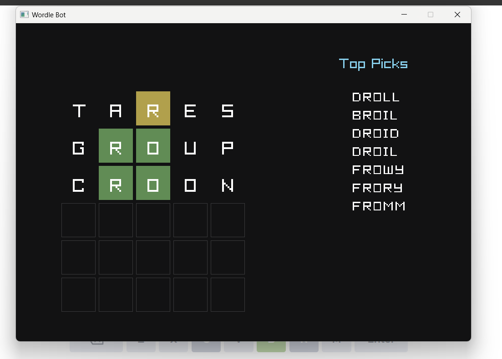

# Wordle Bot

## Overview

The wordle bot is inspired by 3Blue1Browns video.
Built in C++ it uses entropy calculation along with relative frequency ranking of words in english language to get the best guess. The gui was built using raylib for windows.
Has a succes rate of 98.18% with an average score of 3.81



## Usage

Keep the wordle bot open along with your wordle game. Enter the top guess it provides into wordle and enter it into the grid and for each letter use the spacebar to cycle through the colors and click enter to get the next best guess.(Might take a second or two)

## Requirements

- C++14 or later
- Standard Library
- Raylib Library

## Installation

1. Clone the repository:

   ```bash
   git clone <repository-url>
   cd Wordle_Bot
   ```

2. Ensure all the data files are present

- **FiveLetterWords.txt**
- **simulationWords.txt**
- **firstGuess.txt**
- **relativeFreq.txt**
- **Stats.txt**

3. Install the required dependecies

4. Build the project using your preferred C++ build system

## Approach

The wordle bot calculates entropy for each word which is the summation of the product of probabilities multiplies with information bits. The top ten words with highest entropy are then ranked based on their relative frequency in english (The data obtained from kaggle after filtering for valid 5 letter words).
The first guess was precalculated to prevent the huge wait time it would otherwise take. The second guess if the first guess doesnt reduce the list of possibilities by certain amount would be calculated by relative frequencies else it would use entropy.
